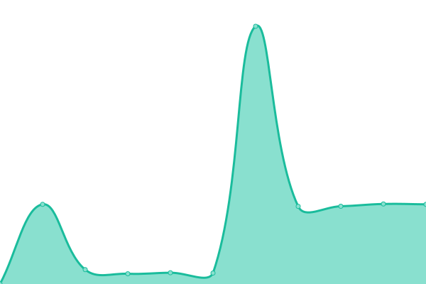

# [📈 Live Status](https://logos914.github.io/potus-estado): <!--live status--> **🟧 Partial outage**

This repository contains the open-source uptime monitor and status page for [Ignacio Tula](www.logos.net.ar), powered by [Upptime](https://github.com/upptime/upptime).

With [Upptime](https://upptime.js.org), you can get your own unlimited and free uptime monitor and status page, powered entirely by a GitHub repository. We use [Issues](https://github.com/logos914/potus-estado/issues) as incident reports, [Actions](https://github.com/logos914/potus-estado/actions) as uptime monitors, and [Pages](https://logos914.github.io/potus-estado) for the status page.

<!--start: status pages-->
<!-- This summary is generated by Upptime (https://github.com/upptime/upptime) -->
<!-- Do not edit this manually, your changes will be overwritten -->
<!-- prettier-ignore -->
| URL | Status | History | Response Time | Uptime |
| --- | ------ | ------- | ------------- | ------ |
|  [PotusTV](https://tv.potus.ar) | 🟩 Up | [potus-tv.yml](https://github.com/logos914/potus-estado/commits/HEAD/history/potus-tv.yml) | 

 742ms
     
 | 

<a href="https://logos914.github.io/potus-estado/history/potus-tv">7.73%</a>
    

|  [Potus++](https://vod.potus.ar) | 🟥 Down | [potus.yml](https://github.com/logos914/potus-estado/commits/HEAD/history/potus.yml) | 

 0ms
     
 | 

<a href="https://logos914.github.io/potus-estado/history/potus">0.00%</a>
    

|  [Potus Eco](https://eco.potus.ar) | 🟥 Down | [potus-eco.yml](https://github.com/logos914/potus-estado/commits/HEAD/history/potus-eco.yml) | 

 0ms
     
 | 

<a href="https://logos914.github.io/potus-estado/history/potus-eco">0.00%</a>
    

|  [Potus Remoto](https://remoto.potus.ar) | 🟥 Down | [potus-remoto.yml](https://github.com/logos914/potus-estado/commits/HEAD/history/potus-remoto.yml) | 

 0ms
     
 | 

<a href="https://logos914.github.io/potus-estado/history/potus-remoto">0.00%</a>
    

<!--end: status pages-->

[**Visit our status website →**](https://logos914.github.io/potus-estado)

## 📄 License

- Powered by: [Upptime](https://github.com/upptime/upptime)
- Code: [MIT](./LICENSE) © [Ignacio Tula](www.logos.net.ar)
- Data in the `./history` directory: [Open Database License](https://opendatacommons.org/licenses/odbl/1-0/)
